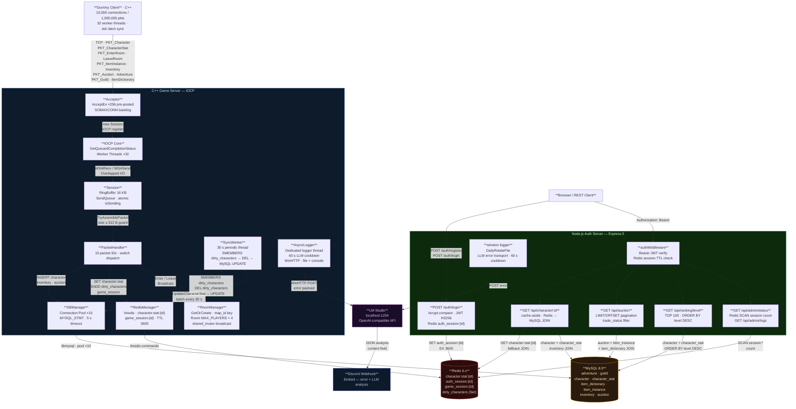

# System Architecture

## Overview



---

## Packet ID Table

| ID   | Struct               | Size   | Direction      | Storage       |
|------|----------------------|--------|----------------|---------------|
| 1000 | PKT_Adventure        | 74 B   | Client → Server | MySQL         |
| 1001 | PKT_Guild            | 88 B   | Client → Server | MySQL         |
| 1002 | PKT_Character        | 107 B  | Client → Server | MySQL         |
| 1003 | PKT_CharacterStat    | 37 B   | Client → Server | Redis → MySQL |
| 1004 | PKT_ItemDictionary   | 359 B  | Client → Server | MySQL         |
| 1005 | PKT_ItemInstance     | 64 B   | Client → Server | MySQL         |
| 1006 | PKT_Inventory        | 25 B   | Client → Server | MySQL         |
| 1007 | PKT_Auction          | 73 B   | Client → Server | MySQL         |
| 1008 | PKT_EnterRoom        | 16 B   | Client → Server | RoomManager   |
| 1009 | PKT_LeaveRoom        | 16 B   | Client → Server | RoomManager   |

> `MAX_PACKET_SIZE = 512 B` — RingBuffer rejects any packet header declaring a size above this threshold.

---

## Thread Model

| Thread              | Count | Responsibility                                      |
|---------------------|-------|-----------------------------------------------------|
| IOCP Worker         | ×32   | Accept / Recv / Send completion dispatch            |
| SyncWorker          | ×1    | Redis → MySQL batch flush every 30 s                |
| AsyncLogger         | ×1    | File I/O · LM Studio POST · Discord webhook         |
| Node.js Event Loop  | ×1    | Express routing · mysql2 pool · ioredis             |

---

## Data Flow: CharacterStat (Write Path)

```
Dummy Client
  │  PKT_CharacterStat (37 B)
  ▼
Session::OnRecvCompleted
  │  RingBuffer::TryAssemblePacket
  ▼
PacketHandler::OnCharacterStat
  │  RedisManager::SetCharacterStat
  │    SET  character:stat:{id}  binary  EX 3600
  │    SADD dirty_characters     {id}
  ▼
Redis  ←── hot path (sub-ms)

SyncWorker (every 30 s)
  │  RedisManager::PopDirtyIds
  │    SMEMBERS dirty_characters  → id 목록 수집
  │    DEL      dirty_characters  → Set 초기화
  │  DBManager::UpdateCharacterStat [MYSQL_STMT]
  ▼
MySQL  ←── cold path (변경된 캐릭터만 · O(dirty 수))
```

---

## Data Flow: CharacterStat (Read Path — Node.js)

```
GET /api/character/:id
  │
authMiddleware (JWT verify + Redis session check)
  │
Redis GET "character:stat:{id}"
  ├── HIT  → return JSON  (no MySQL query)
  └── MISS → MySQL SELECT (character JOIN character_stat)
               │
               └── Redis SET "character:stat:{id}" EX 3600
```
